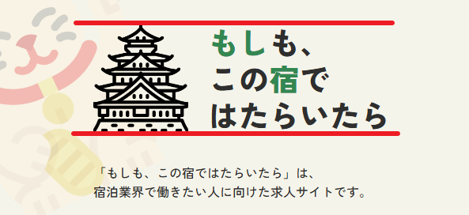

# Layout_FinalHW
## 問題總集
1. 在 banner 區塊，要將 logo 圖和 文字的高度切齊不太容易，
需要刻意的手動將高度拉齊。

2. 客製化 class 和 直接寫在 css 裡面的抉擇:
e.g.
```
img {
  width: 100%;
  height: 100%;
  object-fit: cover;
}
```
以上的 CSS 設定若寫了超過 3 次，我會把它改成一個共用的 class，
但有兩種客製化的流派 
1. atomic css
```
.object-cover {
  object-fit: cover;
}
.w-full {
  width: 100%;
}
.h-full {
  height: 100%;
}
```
2. components
```
.img-cover {
  width: 100%;
  height: 100%;
  object-fit: cover;
}
```
會如何抉擇呢?